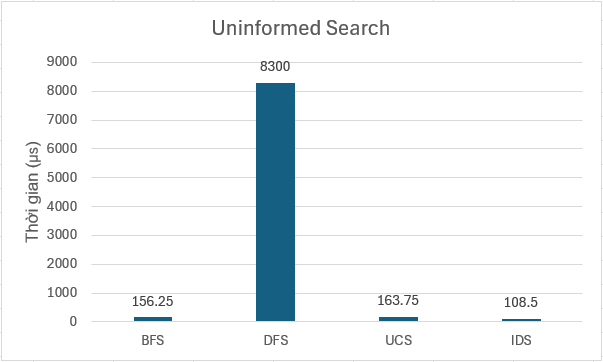

# Áp dụng các thuật toán tìm kiếm lên trò chơi 8 puzzle

## 1. Mục tiêu

Học cách áp dụng các loại thuật toán tìm kiếm lên một trò chơi cụ thể (8 puzzle), từ đó hiểu biết hơn về các thuật toán và có thể so sánh trực tiếp hiệu quả của chúng thông qua tốc độ giải đố.

## 2. Nội dung

# 2.1 Các thuật toán Tìm kiếm không có thông tin

**- BFS:**

Là một thuật toán duyệt hoặc tìm kiếm trong cấu trúc dữ liệu dạng cây hoặc đồ thị theo chiều rộng, tức là thuật toán bắt đầu từ nút gốc (trạng thái ban đầu) rồi duyệt qua tất cả các nút con ở cùng một mức độ (level) trước khi đi sâu hơn.

Tối ưu:				Có 

Hoàn thiện:			Có

Độ phức tạp thời gian:	O(b^d) (b = số nhánh, d = độ sâu)

BFS là thuật toán đơn giản, dễ cài đặt và luôn tìm được lời giải ngắn nhất nếu có nhưng rất tốn bộ nhớ và chậm nếu không gian trạng thái và độ sâu lớn.

Trò chơi 8 puzzle: BFS có thể tìm giải pháp ngắn nhất nếu không gian trạng thái nhỏ.

**- DFS:**

Là một thuật toán duyệt hoặc tìm kiếm trong cây hoặc đồ thị theo chiều sâu, nghĩa là thuật toán bắt đầu từ nút gốc (hoặc trạng thái ban đầu) và luôn duyệt sâu nhất có thể theo một nhánh trước. Khi không còn nhánh để đi tiếp, thuật toán quay lui để thử các nhánh khác.

Tối ưu:				Không

Hoàn thiện:			Có

Độ phức tạp thời gian:	O(b^m) (m = độ sâu tối đa)

DFS là thuật toán đơn giản, dễ cài đặt và ít tốn bộ nhớ hơn BFS nhưng không đảm bảo tìm được giải pháp tối ưu.

Trò chơi 8 puzzle: DFS có thể tìm lời giải nhanh nếu may mắn nhưng dễ bị kẹt ở nhánh sai.

**- Uniform cost search (UCS):**

Là thuật toán tìm kiếm mở rộng nút có tổng chi phí thấp nhất từ trạng thái ban đầu, sử dụng hàm chi phí g(n), trong đó g(n) là tổng chi phí từ nút gốc đến nút n.

Tối ưu:				Có 

Hoàn thiện:			Có

Độ phức tạp thời gian:	O(b^C*/ε) (C* = chi phí tối ưu) và O(b^d) (nếu chi phí mỗi bước = 1)

UCS luôn đảm bảo tìm được lời giải có chi phí thấp nhất nếu tất cả chi phí đều ≥ 0. Nó còn có thể áp dụng cho các bài toán có chi phí không đồng đều. Nhưng UCS sử dụng hàng đợi ưu tiên và cần lưu trữ toàn bộ các trạng thái đã duyệt, dẫn đến tiêu tốn nhiều RAM, đặc biệt trong không gian lớn.

Trò chơi 8 puzzle: UCS sẽ tìm lời giải có số bước đi ít nhất, nếu mỗi bước có chi phí bằng nhau. Tuy nhiên, UCS có thể tốn bộ nhớ và thời gian nếu không gian trạng thái lớn.

**- Iterative deepening search (IDS):**

Là một thuật toán kết hợp ưu điểm của DFS và BFS. Nó lặp đi lặp lại DFS với giới hạn độ sâu tăng dần, từ đó có được sự tiết kiệm bộ nhớ của DFS và tính đầy đủ, tối ưu như BFS.

Tối ưu:				Có 

Hoàn thiện:			Có

Độ phức tạp thời gian:	O(b^d)

IDS sẽ luôn tìm được lời giải tối ưu với bộ nhớ sử dụng ngang với DFS nhưng không tận dụng tốt nếu không gian rất lớn và lời giải rất sâu.

Trò chơi 8 puzzle: IDS rất hữu ích khi muốn giảm bộ nhớ nhưng vẫn đảm bảo tìm được lời giải ngắn nhất.

**Bảng so sánh thời gian**

# 2.2 Các thuật toán Tìm kiếm có thông tin

**- A star:**

Là thuật toán tìm kiếm sử dụng tổng chi phí thực tế từ điểm xuất phát đến một nút (g(n)) và ước lượng chi phí từ nút đó đến đích (h(n)) để mở rộng nút có giá trị f(n) = g(n) + h(n) nhỏ nhất.

Tối ưu:				Có

Hoàn thiện:			Có

Độ phức tạp thời gian:	O(b^d)

A* là một trong những thuật toán mạnh nhất nếu dùng heuristic tốt.

Trò chơi 8 puzzle: A* thường rất hiệu quả, vừa tìm được lời giải ngắn nhất, vừa giảm số lượng trạng thái cần duyệt so với BFS/UCS.

**- Iterative Deepening A star:**

Là phiên bản cải tiến của A*, kết hợp với kỹ thuật iterative deepening. Thay vì mở rộng theo f(n) bằng hàng đợi ưu tiên như A*, IDA* sử dụng giới hạn f(n) tăng dần và duyệt theo chiều sâu.

Tối ưu:				Có

Hoàn thiện:			Có

Độ phức tạp thời gian:	O(b^d)

IDA* tối ưu bộ nhớ hơn A* và vẫn đảm bảo tìm được đường đi tốt nhưng thời gian xử lí thường cao hơn do phải tính lại nhiều trạng thái.

Trò chơi 8 puzzle: IDA* phù hợp khi bộ nhớ bị giới hạn vì không lưu trữ toàn bộ frontier như A*. Tuy nhiên, thời gian xử lý có thể tăng do phải duyệt lại nhiều trạng thái.

**- Greedy search:**

Là thuật toán chỉ sử dụng hàm heuristic h(n), luôn mở rộng nút có giá trị h(n) nhỏ nhất.

Tối ưu:				Không

Hoàn thiện: 			Không

Độ phức tạp thời gian: 	O(b^m)

Là thuật toán khá đơn giản có thể tìm được lời giải nhanh chóng nhưng thường không tìm lời giải tối ưu và dễ rơi vào ngõ cụt.

Trò chơi 8 puzzle: Nhanh chóng tìm được lời giải trong nhiều trường hợp, nhưng có thể bỏ qua lời giải ngắn hơn. Nếu heuristic không tốt, thuật toán có thể thất bại hoặc tiêu tốn nhiều tài nguyên.

**Bảng so sánh thời gian**

# 2.3 Các thuật toán Tìm kiếm cục bộ

**- Simple Hill Climbing:**

Là thuật toán tìm kiếm mà tại mỗi bước chỉ chọn trạng thái lân cận có giá trị heuristic tốt hơn trạng thái hiện tại.

Tối ưu: 			Không

Hoàn thiện: 			Không

Độ phức tạp thời gian: 	Phụ thuộc vào số bước leo dốc

Thuật toán có tốc độ tìm kiếm nhanh và ít tốn bộ nhớ, nhưng không đảm bảo tối ưu toàn cục và hay bị dừng do kẹt ở tối ưu cục bộ .

Trò chơi 8 puzzle: Có thể tìm được lời giải nhanh nếu không gặp đỉnh cục bộ. Tuy nhiên, thường bị kẹt ở trạng thái tối ưu cục bộ và không thể thoát ra và không thể lùi lại nếu đi sai hướng.

**- Steepest Ascent Hill Climbing:**

Là biến thể của hill climbing, thay vì chọn bước đầu tiên tốt hơn, nó xem xét tất cả các trạng thái lân cận và chọn bước có cải thiện lớn nhất.

Tối ưu: 			Không

Hoàn thiện: 			Không

Độ phức tạp thời gian: 	Cao hơn simple hill climbing do cần đánh giá tất cả các lân cận

Thuật toán là sự cải thiện của simple hill climbing nhưng vẫn còn giữ lại điểm yếu là bị kẹt ở tối ưu cục bộ.

Trò chơi 8 puzzle: Tốt hơn simple hill climbing về khả năng thoát khỏi bẫy đơn giản, nhưng vẫn dễ bị mắc kẹt ở đỉnh cục bộ hoặc cao nguyên (plateau).

**- Stochastic Hill Climbing:**

Thuật toán không chọn lân cận tốt nhất mà chọn ngẫu nhiên một trong số các lân cận tốt hơn hiện tại.

Tối ưu: 			Không

Hoàn thiện: 			Không

Độ phức tạp thời gian: 	Tương tự hill climbing, tùy thuộc vào lựa chọn ngẫu nhiên

Thuật toán có nguy cơ kẹt ở cực trị cục bộ thấp hơn do chọn ngẫu nhiên lân cận, dễ cài đặt và có hiệu quả trong không gian trạng thái lớn do tiết kiệm bộ nhớ. Nhưng thuật toán vẫn chưa loại bỏ hoàn toàn khả năng bị kẹt do tính ngẫu nhiên và có thể bỏ lỡ trạng thái tốt hơn nếu không chọn trúng.

Trò chơi 8 puzzle: Giảm khả năng bị mắc kẹt ở đỉnh cục bộ, nhưng vẫn có thể thất bại nếu không có chiến lược mở rộng tốt.

**- Simulated Annealing:**

Thuật toán cho phép đôi khi chấp nhận trạng thái xấu hơn hiện tại để thoát khỏi tối ưu cục bộ, theo một xác suất giảm dần theo thời gian (giống như quá trình luyện kim).

Tối ưu: 			Có (nếu cooling schedule chậm & đủ lâu) 

Hoàn thiện: 			Không

Độ phức tạp thời gian: 	Phụ thuộc vào hàm làm nguội (cooling schedule)

Thuật toán có khả năng thoát khỏi cực trị cục bộ và không cần duyệt toàn bộ không gian tìm kiếm nhưng cần tinh chỉnh nhiều tham số như nhiệt độ, tốc độ làm nguội,...thuật toán cũng không đảm bảo tìm tối ưu toàn cục nếu cooling schedule không đủ tốt và chạy chậm hơn các thuật toán greedy, hill climbing.

Trò chơi 8 puzzle: Hiệu quả khi bài toán có nhiều đỉnh cục bộ. Có thể tìm ra lời giải tốt nếu cấu hình nhiệt độ hợp lý, nhưng hiệu năng và độ chính xác phụ thuộc nhiều vào tham số.

**- Local Beam Search:**

Thuật toán bắt đầu với k trạng thái ngẫu nhiên, tại mỗi bước sẽ mở rộng tất cả và giữ lại k trạng thái tốt nhất trong số hậu duệ để tiếp tục tìm kiếm.

Tối ưu: 			Không (nhưng cao hơn hill climbing)

Hoàn thiện: 			Không

Độ phức tạp thời gian: 	O(k × b) mỗi bước (với k là số chùm, b là số trạng thái lân cận mỗi trạng thái)

Thuật toán làm giảm nguy cơ kẹt ở cực trị cục bộ bằng cách duy trì nhiều trạng thái và tốt trong các bài toán có không gian trạng thái rộng nhưng thuật toán không đảm bảo tìm được tối ưu toàn cục và tốn bộ nhớ nếu k lớn.

Trò chơi 8 puzzle: Giảm khả năng bị kẹt ở đỉnh cục bộ bằng cách khai thác nhiều hướng tìm kiếm song song. Tuy nhiên, nếu tất cả chùm bị kẹt cùng lúc, thuật toán thất bại.

**Bảng so sánh thời gian**

# 2.4 Các thuật toán Tìm kiếm thỏa mãn ràng buộc(CSP)

**- Backtracking Search:**

Là thuật toán thử và sai cổ điển. Gán giá trị cho một biến, sau đó tiếp tục gán cho biến tiếp theo. Nếu vi phạm ràng buộc, quay lui và thử giá trị khác.

Tối ưu: 			Không

Hoàn thiện: 			Có

Độ phức tạp thời gian: 	O(d^n) (n = số biến, d = miền giá trị)

Thuật toán đơn giản và dễ cài đặt, tuy nhiên hiệu suất thấp trong không gian lớn do không tận dụng thông tin ràng buộc. Dễ rơi vào trạng thái quay lui nhiều lần nếu không có chiến lược bổ trợ.

**- Backtracking with Forward Checking:**

Kết hợp backtracking với kiểm tra trước. Mỗi khi gán giá trị cho một biến, thuật toán loại bỏ các giá trị không còn hợp lệ khỏi miền của các biến liên quan.

Tối ưu: 			Không

Hoàn thiện: 			Có

Độ phức tạp thời gian: 	Tốt hơn backtracking cơ bản

Giúp phát hiện vi phạm ràng buộc sớm hơn, từ đó giảm số lượng nhánh phải duyệt. Có thể cải thiện đáng kể hiệu suất trong bài toán có ràng buộc rõ ràng nhưng vẫn gặp giới hạn khi số biến và ràng buộc tăng.

**- Min-Conflict:**

Là thuật toán giải CSP bằng cách bắt đầu với một gán ngẫu nhiên và liên tục chọn biến gây mâu thuẫn nhiều nhất để thay đổi, sao cho giảm xung đột.

Tối ưu: 			Không

Hoàn thiện: 			Không đảm bảo

Độ phức tạp thời gian: 	Thấp (nếu hội tụ nhanh)

Phù hợp với bài toán CSP lớn, đặc biệt là trong các trường hợp có lời giải (ví dụ: lập lịch, sudoku). Tuy nhiên, dễ bị kẹt ở trạng thái không cải thiện thêm được (mắc kẹt tại local minima), và không áp dụng tốt với bài toán có ít biến hoặc ít cấu trúc ràng buộc như 8 puzzle.

## 3. Kết luận

Các thuật toán tìm kiếm đều có điểm mạnh và yếu khác nhau với nhiều biến thể cải tiến nhằm khắc phục hoặc làm giảm khả năng ảnh hưởng của điểm yếu đến thuật toán. Mỗi thuật toán đều có những đặc thù riêng phù hợp với những tác vụ khác nhau. Project là một trải nghiệm giúp ta hiểu biết hơn về những thuật toán tìm kiếm và biết cách áp dụng chúng vào một ứng dụng trò chơi đơn giản.
